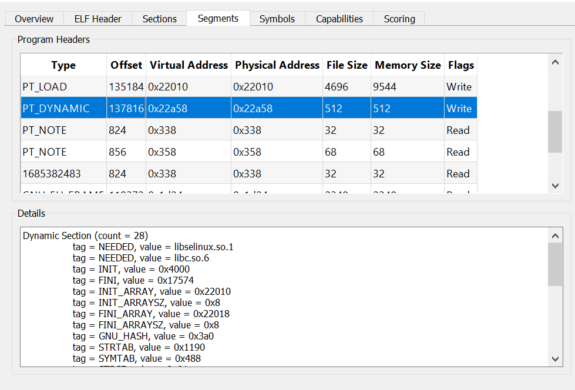
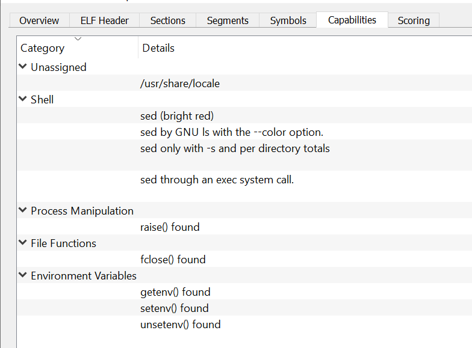

# elfparser-ng

Multiplatform command-line and graphical tool to analyze (suspicious) ELF files. This is an authorized, maintained fork of the great [ELF Parser](https://elfparser.com).

## Features

* File hashes (MD5, SHA-1, and SHA-256).
* File entropy.
* ELF headers, sections and segments parsing.
* ELF symbols.
* Hex Dump.
* Capabilities detection.
* Scoring system.

## Installing

You can download a pre-compiled release from the [Releases](https://github.com/mentebinaria/elfparser-ng/releases) section and use it.

## Screnshots

### Main window

### Segments

### Capabilities

## Building

If you want to build elfparser-ng yourself, here's an useful tutorial:

To build on Windows, set the `option(windows "Enable Windows build." OFF` to `ON` in [CMakeFiles](CMakeLists.txt) file. Then, download and install CMake - and all the dependencies - and compile it using Visual Studio.

### Compile Targets

elfparser-ng has a number of compilation targets configurable in `CMakeLists.txt` file:

* Unit tests
* CLI build
* GUI build

### Dependencies

* Boost
* Qt5

In Debian-based Linux distros, you can install them with:

    apt-get install libboost-all-dev build-essential \ 
                    qtcreator qt5-default qtdeclarative5-dev
